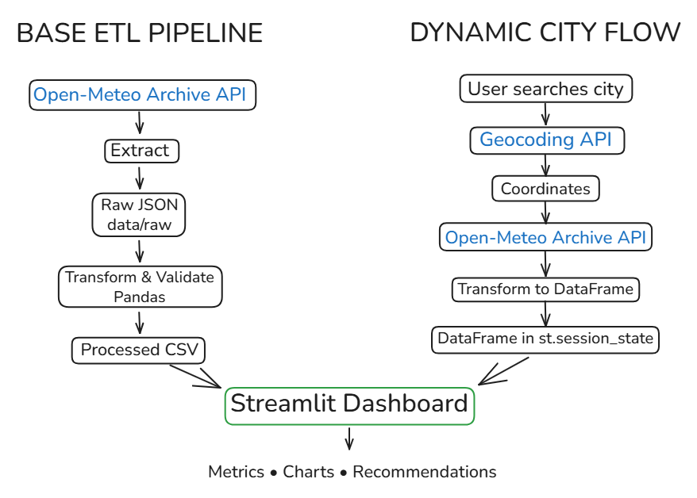

# ✈️ Travel Weather Planner

A Python Data Engineering project for comparing travel destinations and months based on historical weather data from 2021–2025.

The interactive dashboard helps users answer questions such as:
- Which month is better for visiting a destination?
- Which destination has more suitable weather during a selected period?
- What does the weather typically look like throughout the year?

## Features

Users can select one or more destinations and one or more months.

The application includes four predefined destinations and also allows users to search for additional cities dynamically.

The dashboard provides:
- Average temperature
- Percentage of rainy days
- Average monthly precipitation
- Percentage of travel-friendly days
- Comparison between selected months
- Comparison between selected destinations
- Dynamic city search using the Open-Meteo Geocoding API
- Interactive Plotly charts

The base dataset includes:

**Tel Aviv, New York, London and Bangkok**

Additional cities can be searched and analyzed dynamically through the application.

## Data Pipeline

Historical weather data is retrieved from the **Open-Meteo Archive API**.

The ETL pipeline is implemented in `weather_etl.py`:

**Extract**

Weather data for each destination is retrieved from the API and stored as raw JSON files in `data/raw/`.

**Transform**

The data is loaded into Pandas, cleaned and validated.  
The process includes:
- Removing duplicate records
- Handling dates and numeric fields
- Checking missing and invalid values
- Calculating average daily temperature
- Extracting year and month
- Identifying rainy days

**Load**  

The processed data is saved to:

`data/processed/weather_2021_2025.csv`

The final dataset contains more than 7,000 daily weather observations.

### Dynamic City Analysis

Users can also search for cities that are not included in the base dataset.

The application uses the Open-Meteo Geocoding API to find the selected location and retrieve its latitude and longitude.

Historical weather data for the selected city is then retrieved from the Open-Meteo Archive API for the same 2021–2025 period.

The dynamically retrieved data is transformed into the same structure as the processed dataset and combined with the existing data during the current Streamlit session.

Dynamic city data is not permanently stored in the processed CSV.

Unlike the base ETL pipeline, dynamically searched cities are processed in memory and are not saved as raw JSON or added permanently to the processed CSV.

## Travel-Friendly Day

For this project, a day is considered travel-friendly when:

- Average temperature is between 18°C and 28°C
- Precipitation is below 1 mm
- Maximum wind speed is below 25 km/h

This definition is used as a simple metric for comparing destinations and months.

## Dashboard Logic

Users may either select one of the predefined destinations or search for an additional city.

The Streamlit dashboard changes according to the user's selection:

**One destination + one month**  
Shows the typical weather conditions for that month.

**One destination + multiple months**  
Compares the selected months and highlights the recommended, driest, warmest and rainiest months.

**Multiple destinations**  
Compares the selected destinations for the selected period.

The dashboard also shows historical monthly patterns for temperature, precipitation and travel-friendly days.

## Technologies

Python · Pandas · Requests · Streamlit · Plotly · Open-Meteo API · Git · GitHub

## Project Structure

    weather_project/
    ├── app.py
    ├── weather_etl.py
    ├── requirements.txt
    ├── README.md
    ├── .gitignore
    └── data/
        ├── raw/
        └── processed/

## Run the Project

Install the required packages:

`pip install -r requirements.txt`

Run the ETL pipeline:

`python weather_etl.py`

Run the Streamlit dashboard:

`streamlit run app.py`

## Notes

The historical analysis is based on the years **2021–2025**, so it represents recent historical patterns rather than a long-term climatological normal.

Average daily temperature is calculated as:

`(maximum temperature + minimum temperature) / 2`

A rainy day is defined as a day with precipitation greater than 0 mm.

Cities added through the dynamic search are analyzed during the current application session and are not permanently added to the processed dataset.

## Data Flow

